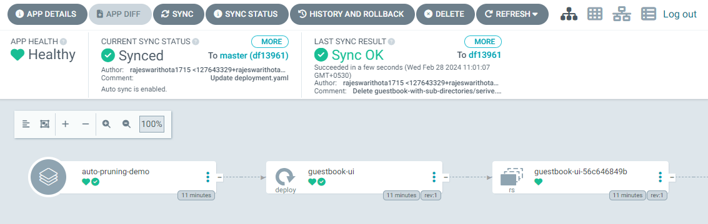
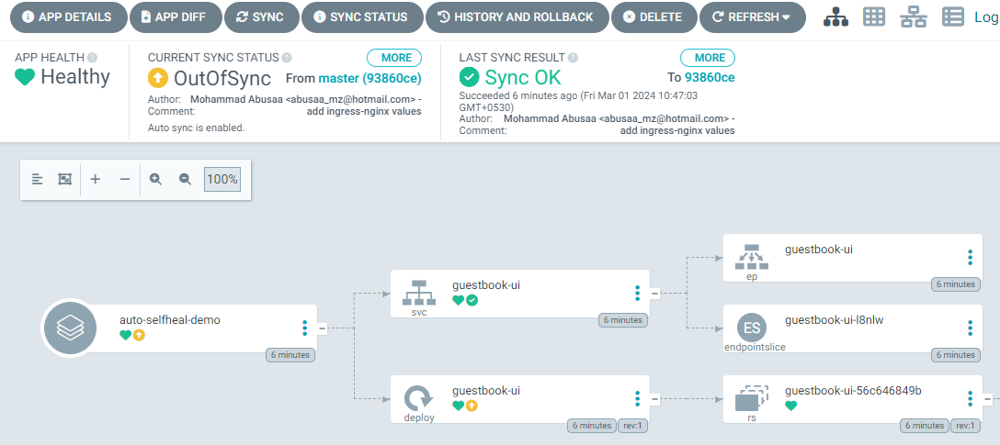

###  Automated Sync

* By default, ArgoCD polls Git repositories every 3 minutes to detect changes to the manifests.
* Argo CD can automatically sync apps when it detects differences between the desired manifests in Git, and the live state in the cluster.
    * No need to do manual sync anymore.
    * CI/CD pipelines no longer need direct access.
####  Notes:
* An automated sync will only be performed if the application is OutOfSync.
* Automatic sync will not reattempt a sync if the previous sync attempt against the same commit-SHA and parameters had failed.
* Rollback cannot be performed against an application with automated sync enabled.

<pre>
apiVersion: argoproj.io/v1alpha1
kind: Application
metadata: 
  name: auto-sync-app 
  namespace: argocd
spec: 
  destination: 
    namespace: auto-sync-app
    server: "https://kubernetes.default.svc"
  project: default
  source: 
    path: guestbook-with-sub-directories
    repoURL: "https://github.com/rajeswarithota1715/argocd-private-repo-for-demo.git"
    targetRevision: master
    directory:
      recurse: true
  syncPolicy:
    automated: {}
    syncOptions:
      - CreateNamespace=true
</pre>

###  CLI

<pre>
argocd app create nginx-ingress --repo https://charts.helm.sh/stable --helmchart nginx-ingress --revision 1.24.3 --dest-namespace default --dest-server 
https://kubernetes.default.svc --sync-policy automated
</pre>

####   WEB UI

###   Automated Pruning

*   Default – no prune: when automated sync is enabled, by default for safety automated sync will not delete resources when Argo CD detects the resource is no longer defined in Git.
*   Pruning can be enabled to delete resources automatically as part of the automated sync

### CLI

<pre>
argocd app create nginx-ingress --repo https://charts.helm.sh/stable --helmchart nginx-ingress --revision 1.24.3 --dest-namespace default --dest-server 
https://kubernetes.default.svc --auto-prune
</pre>

### without enabling auro prune
<pre>
apiVersion: argoproj.io/v1alpha1
kind: Application
metadata: 
  name: auto-pruning-demo 
  namespace: argocd
spec: 
  destination: 
    namespace: auto-pruning-demo
    server: "https://kubernetes.default.svc"
  project: default
  source: 
    path: guestbook-with-sub-directories
    repoURL: "https://github.com/rajeswarithota1715/argocd-private-repo-for-demo.git"
    targetRevision: master
    directory:
      recurse: true
  syncPolicy:
    automated:   {}
    syncOptions:
      - CreateNamespace=true
</pre>

 Apply the application using kubectl and verify that its synced 
directly.

Delete the service file from git repo and notice that its not deleted from destination cluster.

<pre>
controlplane $ kubectl get all -n auto-pruning-demo
NAME                                READY   STATUS    RESTARTS   AGE
pod/guestbook-ui-56c646849b-8ntl8   1/1     Running   0          5m5s

NAME                   TYPE        CLUSTER-IP      EXTERNAL-IP   PORT(S)   AGE
service/guestbook-ui   ClusterIP   10.100.248.76   <none>        80/TCP    5m5s

NAME                           READY   UP-TO-DATE   AVAILABLE   AGE
deployment.apps/guestbook-ui   1/1     1            1           5m5s

NAME                                      DESIRED   CURRENT   READY   AGE
replicaset.apps/guestbook-ui-56c646849b   1         1         1       5m5s
controlplane $ 
</pre>

###   with auto prune enabled
<pre>
apiVersion: argoproj.io/v1alpha1
kind: Application
metadata: 
  name: auto-pruning-demo 
  namespace: argocd
spec: 
  destination: 
    namespace: auto-pruning-demo
    server: "https://kubernetes.default.svc"
  project: default
  source: 
    path: guestbook-with-sub-directories
    repoURL: "https://github.com/rajeswarithota1715/argocd-private-repo-for-demo.git"
    targetRevision: master
    directory:
      recurse: true
  syncPolicy:
    automated:
      prune:  true
    syncOptions:
      - CreateNamespace=true
</pre>

Then, enable the auto pruning in application definition and verify the service is deleted from destination cluster.

<pre>
   controlplane $ kubectl get all -n auto-pruning-demo
NAME                                READY   STATUS    RESTARTS   AGE
pod/guestbook-ui-56c646849b-8ntl8   1/1     Running   0          24m

NAME                           READY   UP-TO-DATE   AVAILABLE   AGE
deployment.apps/guestbook-ui   1/1     1            1           24m

NAME                                      DESIRED   CURRENT   READY   AGE
replicaset.apps/guestbook-ui-56c646849b   1         1         1       24m
</pre>

####   Automated Self Healing

*   By default, changes that are made to the live cluster will not trigger automated sync.
*   ArgoCD has a feature to enable self healing when the live cluster state deviates from Git state.

Before applying auto-heal

<pre>
apiVersion: argoproj.io/v1alpha1
kind: Application
metadata: 
  name: auto-selfheal-demo
  namespace: argocd
spec: 
  destination: 
    namespace: auto-selfheal-demo
    server: "https://kubernetes.default.svc"
  project: default
  source: 
    path: guestbook-with-sub-directories
    repoURL: "https://github.com/mabusaa/argocd-example-apps.git"
    targetRevision: master
    directory:
      recurse: true
  syncPolicy:
    automated: {}
    syncOptions:
      - CreateNamespace=true
</pre>
<pre>
   controlplane $ kubectl get all -n auto-selfheal-demo
NAME                                READY   STATUS    RESTARTS   AGE
pod/guestbook-ui-56c646849b-lpx44   1/1     Running   0          2m28s
pod/guestbook-ui-56c646849b-pn67w   1/1     Running   0          2m28s

NAME                   TYPE        CLUSTER-IP      EXTERNAL-IP   PORT(S)   AGE
service/guestbook-ui   ClusterIP   10.108.85.251   <none>        80/TCP    2m28s

NAME                           READY   UP-TO-DATE   AVAILABLE   AGE
deployment.apps/guestbook-ui   2/2     2            2           2m28s

NAME                                      DESIRED   CURRENT   READY   AGE
replicaset.apps/guestbook-ui-56c646849b   2         2         2       2m28s
controlplane $ 
</pre>

Try to increase the number of replicas in live environment and observe Argo CD will NOT do auto correction (healing) for the actual state.

<pre>
controlplane $ kubectl scale deployment guestbook-ui --replicas=5 -n auto-selfheal-demo
deployment.apps/guestbook-ui scaled
controlplane $ kubectl get pods -n auto-selfheal-demo
NAME                            READY   STATUS    RESTARTS   AGE
guestbook-ui-56c646849b-5vfbx   1/1     Running   0          18s
guestbook-ui-56c646849b-lpx44   1/1     Running   0          4m19s
guestbook-ui-56c646849b-nfwfg   1/1     Running   0          18s
guestbook-ui-56c646849b-pn67w   1/1     Running   0          4m19s
guestbook-ui-56c646849b-whchp   1/1     Running   0          18s
controlplane $ 
</pre>

Now enable the automated self healing in application definition.
<pre>
apiVersion: argoproj.io/v1alpha1
kind: Application
metadata: 
  name: auto-selfheal-demo
  namespace: argocd
spec: 
  destination: 
    namespace: auto-selfheal-demo
    server: "https://kubernetes.default.svc"
  project: default
  source: 
    path: guestbook-with-sub-directories
    repoURL: "https://github.com/mabusaa/argocd-example-apps.git"
    targetRevision: master
    directory:
      recurse: true
  syncPolicy:
    automated:
      selfHeal: true
    syncOptions:
      - CreateNamespace=true
</pre>

Now again try to scale the deployment to 10 replicas, and notice how Argo CD will do the auto-healing automatically.

<pre>
   controlplane $ kubectl scale deployment guestbook-ui --replicas=10 -n auto-selfheal-demo
deployment.apps/guestbook-ui scaled
controlplane $ kubectl get pods -n auto-selfheal-demo
NAME                            READY   STATUS        RESTARTS   AGE
guestbook-ui-56c646849b-4lkgn   0/1     Terminating   0          2s
guestbook-ui-56c646849b-5ll62   0/1     Terminating   0          2s
guestbook-ui-56c646849b-8bfbp   0/1     Terminating   0          2s
guestbook-ui-56c646849b-gq99k   0/1     Terminating   0          2s
guestbook-ui-56c646849b-jhlhq   0/1     Terminating   0          2s
guestbook-ui-56c646849b-kjg6m   0/1     Terminating   0          2s
guestbook-ui-56c646849b-lpx44   1/1     Running       0          10m
guestbook-ui-56c646849b-m52zf   0/1     Terminating   0          2s
guestbook-ui-56c646849b-pn67w   1/1     Running       0          10m
guestbook-ui-56c646849b-tpvbn   0/1     Terminating   0          2s
</pre>

