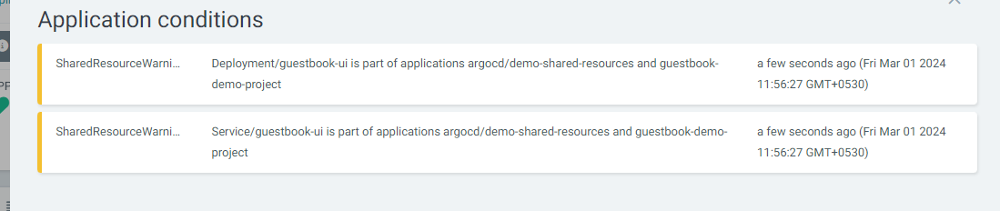

###  Sync options

* Users can customize how resources are synced between target cluster and desired state.
* Most of the options available at application level.

<pre>
apiVersion: argoproj.io/v1alpha1
kind: Application
metadata: 
name: example
spec: 
....
syncPolicy:
syncOptions:
</pre>

• Some of the options available using resources annotations.
<pre>
  metadata: 
annotations: 
argocd.argoproj.io…………
</pre>

####  No Prune 

* ArgoCD can prevent an object from being pruned
* I have deleted one manifests from git repo, the app will be in out of sync but still does not prune the resource.

In the resource itself, can be used as annotation as below:
<pre>
apiVersion: apps/v1
kind: Deployment
metadata:
annotations:
argocd.argoproj.io/sync-options: Prune=false
name: guestbook-ui
spec:
replicas: 2
...
</pre>

####  Disable Kubectl Validation

*  Some resources need to be applied without validating the resources “kubectl apply --validate=false”.
*  You can achieve this in ArgoCD by at application level or resource level.

  Application level:
<pre>
apiVersion: argoproj.io/v1alpha1
kind: Application
metadata: 
name: kustomize-guestbook
namespace: argocd
spec: 
destination: 
namespace: guestbook
server: "https://kubernetes.default.svc"
project: default
source: 
path: kustomize-guestbook
repoURL: "https://github.com/argoproj/argocd-example-apps.git"
targetRevision: HEAD
syncPolicy:
syncOptions: 
- Validate=false
</pre>

Resource level using annotation :
<pre>
apiVersion: apps/v1
kind: Deployment
metadata:
annotations:
argocd.argoproj.io/sync-options: Validate=false
name: guestbook-ui
spec:
replicas: 2
revisionHistoryLimit: 3
…..
</pre>

####  Selective Sync

*  When syncing using auto sync ArgoCD applies every object in the application.
*  Selective sync option will sync only out-of-sync resources. You need when you have thousands of resources in which sync take a long time and puts pressure on Api server.
*  Can be applied at application level only:

Update one resource from git repo in this path sync-options/selective-sync, ex: update deployment file by increasing the replicas.

to apply out of sync resources only then add the syncoption
<pre>
apiVersion: argoproj.io/v1alpha1
kind: Application
metadata: 
name: kustomize-guestbook
namespace: argocd
spec: 
destination: 
namespace: guestbook
server: "https://kubernetes.default.svc"
project: default
source: 
path: kustomize-guestbook
repoURL: "https://github.com/argoproj/argocd-example-apps.git"
targetRevision: HEAD
syncPolicy:
syncOptions: 
- ApplyOutOfSyncOnly=true
</pre>

####  Prune Last

*  ArgoCD can control the sequence of creation/pruning resources, aka waves.
*  You can prune some resources to happen as final using “Prune Last”.
* You can achieve this in ArgoCD by at application level or resource level.

Application Level:
<pre>
apiVersion: argoproj.io/v1alpha1
kind: Application
metadata: 
name: kustomize-guestbook
namespace: argocd
spec: 
destination: 
namespace: guestbook
server: "https://kubernetes.default.svc"
project: default
source: 
path: kustomize-guestbook
repoURL: "https://github.com/argoproj/argocd-example-apps.git"
targetRevision: HEAD
syncPolicy:
syncOptions: 
- PruneLast=true
</pre>

Specific Resorce Level
<pre>
apiVersion: apps/v1
kind: Deployment
metadata:
annotations:
argocd.argoproj.io/sync-options: PruneLast=true
name: guestbook-ui
spec:
replicas: 2
revisionHistoryLimit: 3
…..
</pre>

####  Replace Resources

* By default ArgoCD use “kubectl apply” to deploy the resources changes.
* In some cases you need to “Replace/Recreate” the resources, ArgoCD can do this by using replace=true.
* You can achieve this in ArgoCD by at application level or resource level.

Application Level
<pre>
apiVersion: argoproj.io/v1alpha1
kind: Application
metadata: 
name: kustomize-guestbook
namespace: argocd
spec: 
destination: 
namespace: guestbook
server: "https://kubernetes.default.svc"
project: default
source: 
path: kustomize-guestbook
repoURL: "https://github.com/argoproj/argocd-example-apps.git"
targetRevision: HEAD
syncPolicy:
syncOptions: 
- Replace=true
</pre>

Resource Level
<pre>
apiVersion: apps/v1
kind: Deployment
metadata:
annotations:
argocd.argoproj.io/sync-options: Replace=true
name: guestbook-ui
spec:
replicas: 2
revisionHistoryLimit: 3
…..
</pre>

####  Fail on Shared Resource

* By default ArgoCD will apply the resources even if it was available in multiple applications.
* You can configure the sync to fail if any resource is found in other applications by using FailOnSharedResource=true.
*  Can be applied at application level only:

<pre>
apiVersion: argoproj.io/v1alpha1
kind: Application
metadata: 
name: kustomize-guestbook
namespace: argocd
spec: 
destination: 
namespace: guestbook
server: "https://kubernetes.default.svc"
project: default
source: 
path: kustomize-guestbook
repoURL: "https://github.com/argoproj/argocd-example-apps.git"
targetRevision: HEAD
syncPolicy:
syncOptions: 
- FailOnSharedResource=true
</pre>

